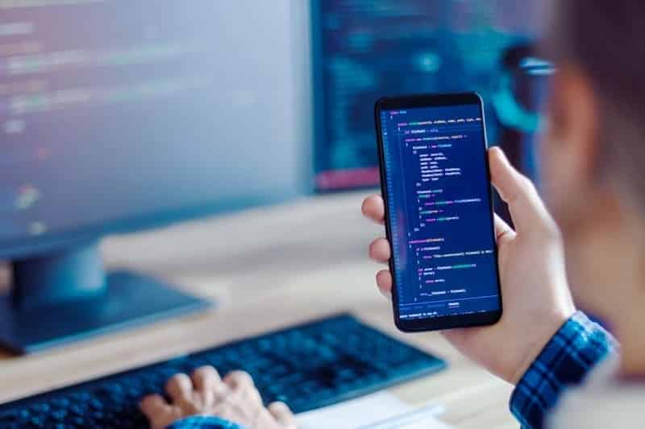
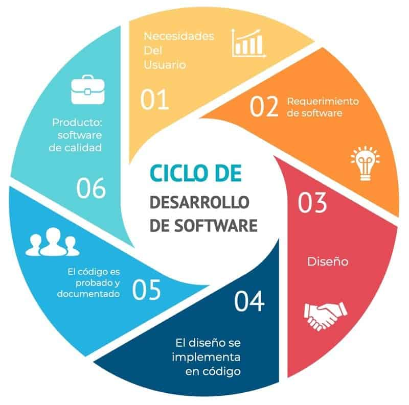

# INTRODUCCIÓN SOFTWARE

## ¿Qué es un programa informático?

Se trata de un conjunto de instrucciones escritas en lenguaje de programación que un equipo informático procesa para cumplir con una función determinada, en otras palabras, es un grupo de ordenes que el ordenador sigue para algo específico.

## Diferencia entre código fuente, código objeto y código ejecutable.

* El **código fuente** es un lenguaje de alto nivel escrito por un programador y se caracteriza por su facilidad para ser entendido por otras personas.
* El **código objeto** no es nada más que el resultado de la compilación del código fuente, está en lenguaje de máquina, es decir, en lenguaje binario (ceros y unos) y no se puede ejecutar de forma directa.
* Para que el código objeto pueda ser ejecutado debe pasar por un proceso llamado enlazado, el resultado de ese enlazado es a lo que se le conoce como el **código ejecutable**.

## Etapas del desarrollo del software

| **Etapas** | **Descripción** |
|------------|-----------------|
| Planificación | Se establecen las bases del proyecto, sus objetivos y cómo conseguirlos. |
| Análisis | Estudio detallado de los requisitos del software, usando diagramas y especificaciones detalladas para evitar errores.|
| Diseño | Escoger como será la arquitectura general del software y cómo conseguir que sus componentes principales se relacionen e interactúen.|
| Desarrollo | Traducción de todo lo planeado al código real, compilando una solución de software completa. |
| Pruebas | Realización de pruebas para ver si el software funciona y que no tenga errores. |
| Implementación | El software ya está completo y listo para ser utilizado.
| Mantenimiento | Actualizar el software, supervisar su rendimiento, corregir los errores que vayan saliendo... Todo esto ayuda a garantizar que el software funcione correctamente a lo largo del tiempo. |

## Bibliografía

[Código fuente, código objeto y código ejecutable](https://www.studocu.com/es/document/instituto-de-educacion-secundaria-poligono-sur/matematicas-ii/13codigos-fuente-objeto-y-ejecutable/104853597?sid=4d4439c0-6810-4c34-be66-6e9da15835961789747190)

[Etapas del software](https://www.microsoft.com/es-es/power-platform/topics/phases-of-the-software-development-lifecycle)

### Enlace del repositorio: 

[Repositorio del proyecto](https://github.com/Valenmg240/1DAMP\_MejiaGarzon\_Valentina.git)

